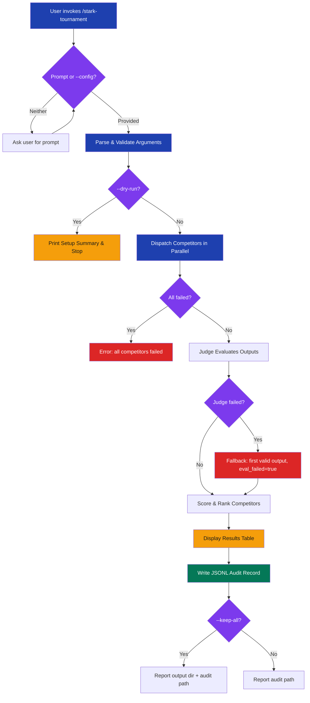

# stark-tournament

Run multi-LLM tournaments: N competitors on the same task, evaluated by a judge, winner declared. Use when the user says "run a tournament", "compare LLMs", "which model is best for", "compete", or invokes /stark-tournament.

## Workflow Overview

![Usage guide for the stark-tournament skill showing a vertical workflow diagram with 5 phases (Parse & Validate, Dispatch Competitors, Judge Evaluates, Display Results, Audit Record), three evaluation strategy cards (semantic, visual, test), six common workflow examples with command-line invocations, an example terminal output showing a ranked results table with claude winning at 8.5/10, an arguments reference table with 13 parameters, a failure recovery table, and quality scoring thresholds. Color-coded using blue for phases, purple for decisions, amber for outputs, green for config, and red for failures.](usage.png)

## When to Use

Run multi-LLM tournaments: N competitors on the same task, evaluated by a judge, winner declared. Use when the user says "run a tournament", "compare LLMs", "which model is best for", "compete", or invokes /stark-tournament.

## Prerequisites

stark-skills installed (`./install.sh`), Python venv at `~/.claude/code-review/scripts/.venv/`, tournament.py script present, at least 2 LLM CLI tools available (claude, codex, gemini)

## Arguments

`'"prompt" | --config tournament.yaml [--strategy semantic|visual|test] [--competitors claude,codex,gemini] [--factors correctness=2.0 quality=1.0] [--judge MODEL] [--timeout N] [--json]'`

| Argument | Type | Default | Description |
|----------|------|---------|-------------|
| `"prompt"` | positional | — | Inline prompt text (quoted) |
| `--config` | path | — | YAML config file |
| `--strategy` | enum | semantic | Evaluation: semantic, visual, test |
| `--competitors` | list | claude,codex,gemini | Comma-separated competitor IDs |
| `--factors` | key=weight | correctness=2.0 completeness=1.0 quality=1.0 | Weighted evaluation factors |
| `--judge` | model | claude-sonnet-4-6 | Judge model |
| `--test-file` | path | — | Test file (required for test strategy) |
| `--output-dir` | path | auto | Output directory |
| `--timeout` | seconds | 300 | Per-competitor timeout |
| `--variables` | key=value | — | Prompt template substitution |
| `--keep-all` | flag | off | Keep all competitor outputs |
| `--json` | flag | off | JSON output |
| `--dry-run` | flag | off | Print config and exit |

## Quick Start

/stark-tournament "Write a Python function to parse ISO 8601 dates"

## Common Patterns

**Quick 3-way comparison:** `/stark-tournament "Write a retry decorator"` — uses all defaults (claude, codex, gemini + semantic strategy).

**Test-driven evaluation:** `/stark-tournament "Implement merge sort" --strategy test --test-file tests/test_sort.py` — objective pass/fail scoring.

**Custom-weighted factors:** `/stark-tournament "JWT auth middleware" --factors security=3.0 correctness=2.0 readability=1.0` — emphasize what matters most for the task.

## Troubleshooting

**"Run install.sh to set up stark-skills"** — tournament.py not found. Run `./install.sh` from the stark-skills repo root.

**All competitors fail** — check that competitor CLI tools are installed and accessible. Try increasing `--timeout` for complex prompts.

**Invalid YAML config** — validate your config file with `python -c "import yaml; yaml.safe_load(open('tournament.yaml'))"` before running.

**Judge fails** — fallback activates automatically (first valid output wins with `eval_failed: true`). Check judge model availability if this persists.

## Related Skills

`/stark-review`, `/stark-metrics`, `/stark-skill-analytics`
